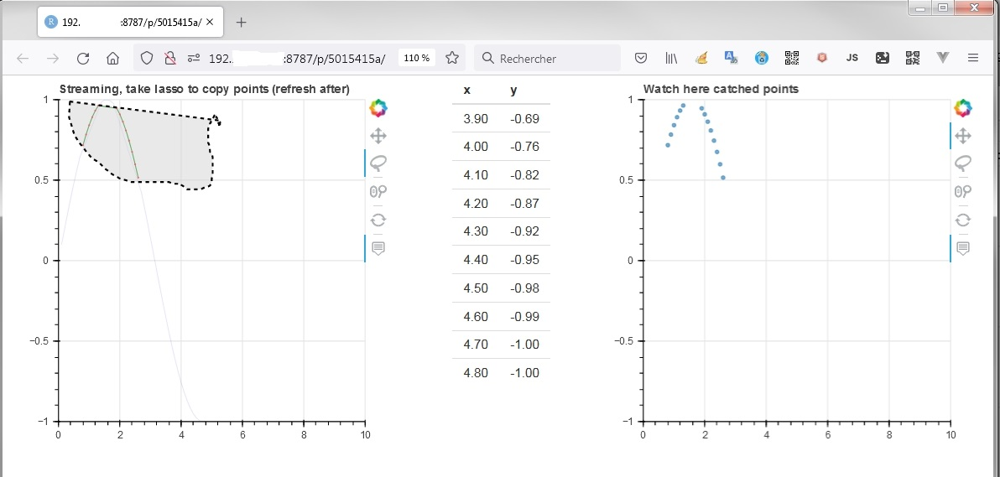

# POC: Bokeh in R Shiny



# Origins of my  R Shiny Bokeh POC 

-   my question : [Flask with `import bokeh` with 2 bokeh graphs without external bokeh server and not "Models must be owned by only a single document"](https://stackoverflow.com/questions/68224939/flask-with-import-bokeh-with-2-bokeh-graphs-without-external-bokeh-server-and/68240148)

-   my auto answer: [Here is a POC with import bokeh without external bokeh server and with vue (vue3,vuex4, composition-api) because I didn't found a tutorial for my needs.](https://stackoverflow.com/questions/68224939/flask-with-import-bokeh-with-2-bokeh-graphs-without-external-bokeh-server-and/68240148#68240148)

-   my FlaskVueBokehPOC : <https://github.com/philibe/FlaskVueBokehPOC>

-   my business needs

# Here is a conversion from Flask to R Shiny

Here is the equivalent from FlaskVueBokehPOC to RshinyBokehReticulatePOC.

## Server 

### FlaskVueBokehPOC

`server/app.py`

``` {.python}
@app.route("/api/datasinus/<operation>", methods=['GET', 'POST'])
    def get_x(operation):
      [..]
      return jsonify(..)
[..]      
@app.route("/api/bokehinlinejs", methods=['GET', 'POST'])
    def simple():
        streaming = True

        s1 = AjaxDataSource(data_url="/api/datasinus/increment", polling_interval=1000, mode='append')

        s1.data = dict(x=[], y=[])

        s2 = ColumnDataSource(data=dict(x=[], y=[]))

        s1.selected.js_on_change(
            'indices',
            CustomJS(
                args=dict(s1=s1, s2=s2),
                code="""
            var inds = cb_obj.indices;
            var d1 = s1.data;
            var d2 = s2.data;
            d2['x'] = []
            d2['y'] = []
            for (var i = 0; i < inds.length; i++) {
                d2['x'].push(d1['x'][inds[i]])
                d2['y'].push(d1['y'][inds[i]])
            }
            s2.change.emit();
            
            """,
            ),
        )

        p1 = figure([..])

        p1.line('x', 'y', source=s1, color="blue", selection_color="green")
        p1.circle('x', 'y', size=1, source=s1, color=None, selection_color="red")

        p2 = figure([..])
        p2.circle('x', 'y', source=s2, alpha=0.6)

        response_object = {}
        response_object['gr'] = {}

        script, div = components({'p1': p1, 'p2': p2}, wrap_script=False)
        response_object['gr']['script'] = script
        response_object['gr']['div'] = div
        return response_object
```

### RshinyBokehReticulatePOC

`RshinyBokehReticulatePOC.py` is called by R with `reticulate` R package in `RshinyBokehReticulatePOC_server_rshiny.R`:

    reticulate::source_python(file.path(getwd(),"ui_server_rshiny","server_rshiny","RshinyBokehReticulatePOC.py"))
    api_bokehinlinejs_datas_js=py$api_bokehinlinejs(paste0(isolate(api_datasinus_ajax_url_react()),"&operation=increment" ) )
    
And called by 
```R
session$registerDataObj(
    [..]
    filter = function(data, req) {
      shiny:::httpResponse(
        200, "application/json",
        {
           [... the origin of the datas are received and pushed here... ]
```
links about  `session$registerDataObj()`:

- https://stackoverflow.com/questions/25297489/accept-http-request-in-r-shiny-application/25299306#25299306
- https://stackoverflow.com/questions/23635552/shiny-datatable-with-child-rows-using-ajax/25165727#25165727
- https://shiny.rstudio.com/gallery/selectize-rendering-methods.html
- https://shiny.rstudio.com/reference/shiny/latest/session.html
 

`ui_server_rshiny/server_rshiny/RshinyBokehReticulatePOC.py`:

    from bokeh.embed import json_item, components
    from bokeh.plotting import figure, curdoc
    from bokeh.models.sources import AjaxDataSource, ColumnDataSource

    from bokeh.models import CustomJS
    [...]
        def api_bokehinlinejs(data_url)::
            streaming = True

            s1 = AjaxDataSource(data_url="/api/datasinus/increment", polling_interval=1000, mode='append')

            s1.data = dict(x=[], y=[])

            s2 = ColumnDataSource(data=dict(x=[], y=[]))

            s1.selected.js_on_change(
                'indices',
                CustomJS(
                    args=dict(s1=s1, s2=s2),
                    code="""
                var inds = cb_obj.indices;
                var d1 = s1.data;
                var d2 = s2.data;
                d2['x'] = []
                d2['y'] = []
                for (var i = 0; i < inds.length; i++) {
                    d2['x'].push(d1['x'][inds[i]])
                    d2['y'].push(d1['y'][inds[i]])
                }
                s2.change.emit();
                
                """,
                ),
            )

            p1 = figure([..])

            p1.line('x', 'y', source=s1, color="blue", selection_color="green")
            p1.circle('x', 'y', size=1, source=s1, color=None, selection_color="red")

            p2 = figure([..])
            p2.circle('x', 'y', source=s2, alpha=0.6)

            response_object = {}
            response_object['gr'] = {}

            script, div = components({'p1': p1, 'p2': p2}, wrap_script=False)
            response_object['gr']['script'] = script
            response_object['gr']['div'] = div
            return response_object

`ui_server_rshiny/server_rshiny/RshinyBokehReticulatePOC_server_rshiny.R`:

    api_datasinus <- function (var_session_param,operation) {...}

    api_datasinus_ajax_url_react <- reactive({
      ajax_url=  session$registerDataObj(
        data= NA,
        name = "api_datasinus_ajax_url_name", # an arbitrary name for the AJAX request handler
        filter = function(data, req) {
          operationParam <- parseQueryString(req$operation)
          
          query <- parseQueryString(req$QUERY_STRING)
          operationQueryParam <- query$operation
          
          shiny:::httpResponse(
            200, "application/json",
            {
              response_object =list()
              react$var_session_param <- var_session <-api_datasinus(isolate(react$var_session_param),operationQueryParam)

              [..]
              RJSONIO:::toJSON(response_object)
            }
          )
        }
      )
      
      session$sendInputMessage("api_datasinus_ajax_url", list(value=ajax_url))
      
      ajax_url
    })

    [..]
    api_bokehinlinejs_ajax_url_react <- reactive({
      
      req(api_datasinus_ajax_url_react())
      
      ajax_url=  session$registerDataObj(
        data= NA,
        name = "api_bokehinlinejs_ajax_url_name", # an arbitrary name for the AJAX request handler
        filter = function(data, req) {
          shiny:::httpResponse(
            200, "application/json",
            {
              reticulate::source_python(file.path(getwd(),"ui_server_rshiny","server_rshiny","RshinyBokehReticulatePOC.py"))
              
              api_bokehinlinejs_datas_js=py$api_bokehinlinejs(paste0(isolate(api_datasinus_ajax_url_react()),"&operation=increment" ) )
              RJSONIO:::toJSON(api_bokehinlinejs_datas_js)
            }
          )
        }
      )
      
      # Correlated on the UI side with :  tags$input(id="api_bokehinlinejs_ajax_url", type="text", value="", class="shiny-bound-input", style="display:none;"),  
      session$sendInputMessage("api_bokehinlinejs_ajax_url", list(value=ajax_url))
      
      
      ajax_url
    })

## Frontend 

### FlaskVueBokehPOC

`frontend/src/pages/ProdSinusPage.vue`

``` {.html}
<template>
  <div class="row" style="width: 60%">
    <div id="bokeh_ch1" class="column left"></div>
    <div class="column middle">
      <ul>
        <li v-for="data in datasinus" :key="data.x">
          [[ currency(data.x,'',2) ]] - [[currency(data.y,'',2) ]]
        </li>
      </ul>
    </div>
    <div id="bokeh_ch2" class="column right"></div>
  </div>
</template>
<script setup>
[..]
const store = useStore();
const datasinus = computed(() => store.state.modprodsinus.datasinus);
const bokehinlinejs = computed(() => store.state.modprodsinus.bokehinlinejs);

async function get1stJsonbokeh() {
  const promise = new Promise((resolve /*, reject */) => {
    setTimeout(() => {
      return resolve(bokehinlinejs.value);
    }, 1001);
  });
  let result = await promise;
  var temp1 = result.gr;
  document.getElementById("bokeh_ch1").innerHTML = temp1.div.p1;
  document.getElementById("bokeh_ch2").innerHTML = temp1.div.p2;
  eval(temp1.script);
}
get1stJsonbokeh();

[..]
</script>
```

### RshinyBokehReticulatePOC

`ui_server_rshiny/server_rshiny/RshinyBokehReticulatePOC_server_rshiny.R`:

    observeEvent(
      All_Ajax_registerDataObj_filled()
      , {
        shinyjs::js$bokeh_graph1()
      },ignoreNULL = TRUE  ,once=TRUE
    )

`ui_server_rshiny/server_rshiny/RshinyBokehReticulatePOC_ui_rshiny.R`:

    RshinyBokehReticulatePOC_ui_rshiny<-
      fluidPage(
        tags$head(
          HTML(
            '
          <script src="https://cdnjs.cloudflare.com/ajax/libs/bokeh/2.3.3/bokeh.min.js" crossorigin="anonymous"></script>
          '
          ),
          useShinyjs(),
          HTML(
            "
                      <script>
                       var api_bokehinlinejs_ajax_url = null;
                       $(document).on('change', '#api_bokehinlinejs_ajax_url', function(event) {
                          api_bokehinlinejs_ajax_url = $(this).val();
                          Shiny.onInputChange('api_bokehinlinejs_ajax_url_loaded', api_bokehinlinejs_ajax_url);
                       });
                      </script>
                      "
          ),
          HTML(
            "
                      <script>
                       var api_datasinus_ajax_url = null;
                       $(document).on('change', '#api_datasinus_ajax_url', function(event) {
                          api_datasinus_ajax_url = $(this).val();
                          Shiny.onInputChange('api_datasinus_ajax_url_loaded', api_datasinus_ajax_url);
                       });
                      </script>
                      "
          ),
          shinyjs::extendShinyjs(
            text = "
                      shinyjs.bokeh_graph1 = function() { 
                          var req = new XMLHttpRequest();
                          req.overrideMimeType('application/json');
                          console.log(api_bokehinlinejs_ajax_url);
                          req.open('POST', api_bokehinlinejs_ajax_url, true)
                          req.onload  = function() {
                              var result = JSON.parse(req.responseText);
                              console.log(result);
                              var temp1 = result.gr;
                              document.getElementById('bokeh_ch1').innerHTML = temp1.div.p1;
                              document.getElementById('bokeh_ch2').innerHTML = temp1.div.p2;
                              eval(temp1.script);
                          };
                          req.send()
                      }
                  ",
            functions = c("bokeh_graph1")
            
          ),
          tags$input(id="api_datasinus_ajax_url", type="text", value="", class="shiny-bound-input", style="display:none;"),      
          tags$input(id="api_bokehinlinejs_ajax_url", type="text", value="", class="shiny-bound-input", style="display:none;"),      

        ),
        splitLayout(
          div(id="bokeh_ch1"),
          div(tableOutput('data_HistoryArray')),
          div(id="bokeh_ch2"),
          cellWidths =c("25%","50%","25%")  ,
          cellArgs = list(align = "center")
        )
      )
